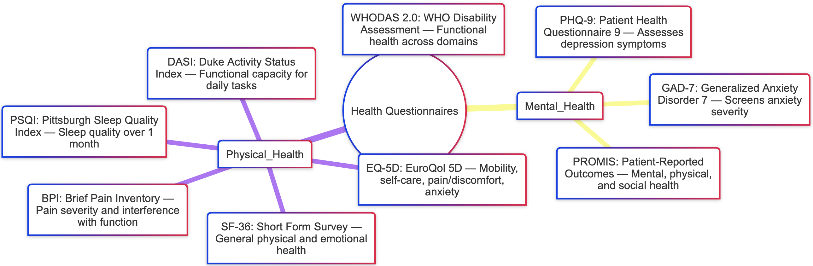

# Enhancing Health Insights through Smart Ring Biometrics and Model-Based Enrichment of Health Questionnaires

**Master Thesis – University of Tübingen**  
*Lennart Kremp | Supervised by Prof. Dr. Daniel Pfeifer (PfeiferLab) | Supported by Marc Mausch (ZIV)*

---

##  Abstract

This thesis investigates how physiological data collected by consumer smart rings can be used to automatically enrich and validate standardized digital health questionnaires. The project focuses on the development of a modular pipeline that collects, harmonizes, and aligns biosignals such as heart rate variability (HRV), skin temperature, sleep metrics, and accelerometer-derived activity levels with the timeframes referenced in clinically validated surveys (e.g., PHQ-9, Pittsburgh Sleep Quality
Index).

To provide physiological context to self-reported symptoms, the pipeline integrates models for stress and health scoring and applies them to raw or preprocessed biosignals. These computed scores are then temporally aligned with questionnaire intervals to support more objective interpretation. The proposed system is designed to be interoperable across devices from different manufacturers by applying signal normalization, temporal alignment, and standardized feature transformation.

Validation will be conducted through a small-scale observational study at the University of Tübingen, using smart rings to collect biosignal data from participants in parallel with questionnaire responses. The project aims to demonstrate the feasibility and potential clinical value of wearable-integrated digital health assessments that combine subjective self-reporting with objective physiological data.

---

##  Objectives

- Collect and harmonize smart ring biosignals using open APIs or data exports  
- Time-align biosignal streams with digital questionnaires  
- Apply and evaluate models for stress/health score prediction  
- Build a modular pipeline using FHIR-compatible structures  
- Validate results with a small-scale academic study

---

##  Use Case Example

- **Survey item**: "Feeling tired or having little energy" (PHQ-9)  
- **Biosignals**: Low HRV, poor sleep efficiency, elevated skin temperature  
- **Enrichment**: Objective biosignals mapped to reported symptoms for clinical relevance

---

##  Technology Stack (Planned)

- Python (data transformation, modeling)
- FHIR standard for questionnaire alignment
- Stress-scoring models 
---

---
## Possible Health Questionnaires

##  Collaborations & Support

This project is made possible by support from:
- [**PfeiferLab – Methods in Medical Informatics**, University of Tübingen](https://uni-tuebingen.de/fakultaeten/mathematisch-naturwissenschaftliche-fakultaet/fachbereiche/informatik/lehrstuehle/methods-in-medical-informatics/) 
- [**Center for innovative care (ZIV) at the University of Tübingen**](https://mwk.baden-wuerttemberg.de/de/forschung/forschungspolitik/digitaler-wandel/projekte-digitalbw/zentrum-fuer-innovative-versorgung-ziv)  
- **(Proposed)** Device support from ring manufacturers :)

---

##  Contact

 **lennart.kremp [at] student.uni-tuebingen.de**  
 University of Tübingen, Germany  
 [LinkedIn](www.linkedin.com/in/lennart-kremp42)

---

> _Academic use only. No commercial use of device APIs or models. This repository will contain simulation/test data and reference links only._
